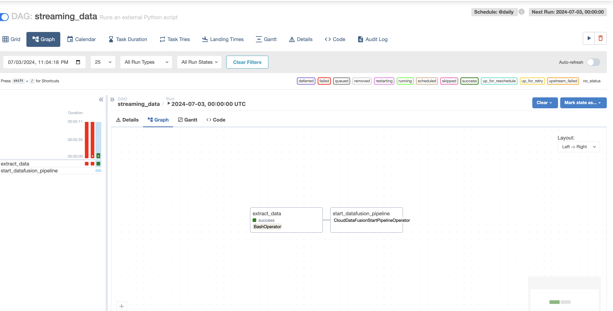

# ETL Data Pipeline for Simulating Netflix Streaming Data

This repository contains an ETL (Extract, Transform, Load) pipeline designed to simulate Netflix streaming data. The pipeline extracts dummy data, stores it in Google Cloud Storage, processes it using Google Cloud Data Fusion and Google Cloud Dataprep, and loads it into Google BigQuery for visualization in Looker Studio. The entire process is automated using Apache Airflow.


## Table of Contents

- [Overview](#overview)
- [Architecture](#architecture)
- [Components](#components)
  - [Data Extraction](#data-extraction)
  - [Data Transformation](#data-transformation)
  - [Data Loading](#data-loading)
  - [Visualization](#visualization)
  - [Automation](#automation)
- [Prerequisites](#prerequisites)
- [Setup](#setup)
- [Usage](#usage)
- [Contributing](#contributing)
- [License](#license)

## Overview

This project demonstrates the use of various Google Cloud Platform (GCP) services to create an end-to-end data pipeline. The goal is to simulate a streaming service environment, similar to Netflix, and process the data to generate insights.

## Architecture

The pipeline consists of the following steps:

1. **Data Extraction**: Generate dummy streaming data using the Faker library.
2. **Data Storage**: Store the extracted data in Google Cloud Storage (GCS).
3. **Data Transformation**: Use Google Cloud Data Fusion to clean and transform the data.
4. **Data Loading**: Load the transformed data into Google BigQuery.
5. **Visualization**: Create interactive dashboards in Looker Studio.
6. **Automation**: Automate the entire process using Apache Airflow.

## Components

### Data Extraction

The data extraction process is implemented in the `extract.py` script. This script uses the `Faker` library to generate realistic dummy data representing users, their activities, and other relevant details.
Storing data into GCS first create bucket


Extracting information into GCS and previewing we can see the following


### Data Transformation

Google Cloud Data Fusion is used to clean and transform the extracted data. The transformations ensure that the data is structured and ready for analysis.


Data looks like after masking transformation


We can apply transformations on data as shown


### Data Loading

Transformed data is loaded into Google BigQuery, where it can be queried and analyzed. BigQuery offers a scalable and efficient way to handle large datasets.


### Visualization

Looker Studio (formerly Google Data Studio) is used to create interactive dashboards that visualize the data. These dashboards provide insights into user behavior, content popularity, and other key metrics.

Transformed information visualized on dashboard


Adding style and some charts for better UI


Adding a filter on subscription


### Automation

Apache Airflow orchestrates the entire ETL process. The `dag.py` script defines a Directed Acyclic Graph (DAG) that schedules and manages the tasks.

Before automation, if you delete all data, looker studio provides error:


Creating the composer environment 


Adding faker library so that we can use it in our workflow


we get the apache airflow folder to place our dag.py inside scripts folder


Then we see our pipeline starts running after first component finishes


Pipeline is triggered


Logs show airflow waiting for pipeline to succeed


Logs show pipeline has succeeded


Finally we can see the data flowed into the GCS and it works!


Opening Looker studio we saw information populated again


Lets take a look at API's used:


Now we can disable all resources and close project environment


## Prerequisites

- Google Cloud Platform account
- Apache Airflow installed
- Google Cloud SDK installed and configured
- Python 3.x installed

## Setup

1. **Clone the repository:**
   ```
   git clone https://github.com/yourusername/netflix-etl-pipeline.git
   cd netflix-etl-pipeline
   ```
2. **Clone the repository:**
   ```
   git clone https://github.com/yourusername/netflix-etl-pipeline.git
   cd netflix-etl-pipeline
   ```
3. **Set up Google Cloud Storage:**
   
    * Create a GCS bucket.
    * Update the bucket name in extract.py.
   
4. **Configure Google Cloud Data Fusion and BigQuery:**
   
   *   Set up a Data Fusion instance.
   * Create a BigQuery dataset.
5. **Create Composer environent**
   * Create composer v2 environment or v3. Autoscaling and create user generated service account with roles of Composer admin, and Data fusion admin for permissions.
6. **Configure Apache Airflow:**
   * Update the DAG configuration in dag.py with your project-specific details.

## Contributing

Contributions are welcome! Please follow these steps to contribute:

1. Fork the repository.
2. Create a new branch with a descriptive name.
3. Make your changes and commit them with clear and concise messages.
4. Push your changes to your fork.
5. Open a pull request to the main repository.

Please ensure your code follows the project's coding standards and passes all tests.

## License

This project is licensed under the MIT License. See the [LICENSE](LICENSE) file for details.

